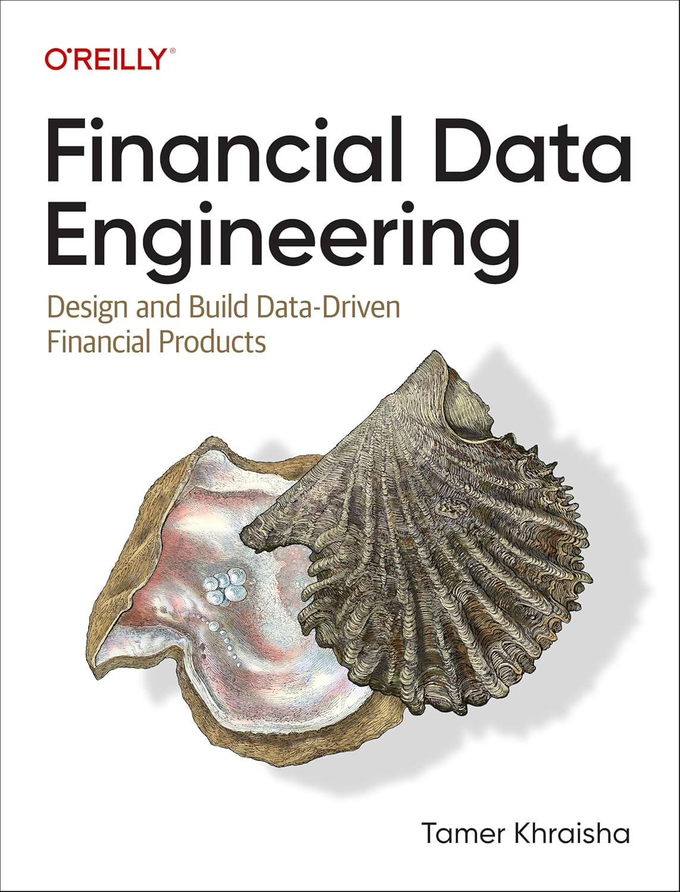

# Financial Data Engineering (O'Reilly)



[Get 30-days free access to O'Reilly](https://learning.oreilly.com/get-learning/?code=FDE2024)

This repository serves as a comprehensive resource where you'll find everything related to the book, including:

- **Code**: All Python scripts and Jupyter Notebooks used throughout the book.
- **Projects**: Detailed project files and case studies that extend the book's content.
- **References**: A curated list of all references and sources used in the creation of the book.
- **Updates**: Any revisions, errata, or updates to the book's material.
- **Conference Material**: Slides, recordings, and other resources from talks, workshops, and conferences related to the book.

This repository is designed to support your learning journey and provide you with all the tools you need to dive deeper into the book's topics. Feel free to explore, use the resources, and contribute if you have any improvements or additional materials to share.
## Overview

This repository contains code examples and projects for the book "Financial Data Engineering". The book covers various aspects of working with financial data, including data collection, processing, analysis, and visualization.

## Table of Contents

## Usage

To get started, clone this repository to your local machine:

```bash
git clone https://github.com/TamerKhraisha/FinancialDataEngineering.git
